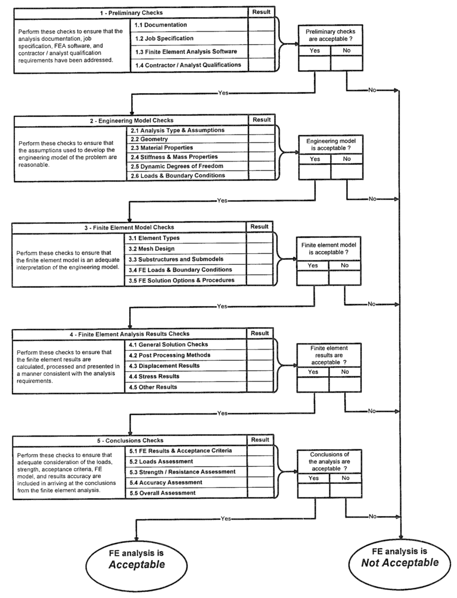

# 有限元计算机制流程建设

[TOC]

## 简介

有限元分析 (FEA) 是当今最常用的结构分析工具。随着计算机硬件和软件的进步，有限元分析计算速度和理论都取得了长足的进步，该技术成本也迅速降低，现在已经广泛运用到机械、土木、航空航天、汽车等各个领域。

但是由于业内CAE工程师的水平良莠不齐，并不是每个人都能胜任仿真的工作，如果在产品和设备投入使用时发现设计仿真时的错误，此时整改或修正产生的费用是非常昂贵的。

当工程师计算通过Abaqus或ANSYS计算得到某个结果时，通常会遇到一个窘境，不知道自己算的到底对不对。这种现象源于对物理现象本质了解的缺失以及对软件认识的匮乏。

另外需求提出者往往对有限元认识不足，一方面分析的目的、背景交代不足，另一方面高估或低估团队CAE分析能力，导致重复返工，结果不具有参考价值。

因此，合适的机制流程建设应对一下几个方面做出改进：

1. 帮助规避产品设计过程中由于仿真模型输入错误（模型、材料属性、载荷）、有限元模型错误(单元、边界)、后处理和结论错误带来的风险。
2. 帮助提高CAE工程师对工作流程认知，提升工程师的认知。
3. 帮助需求提出方完善输入，全面思考，避免不必要的仿真。

## 结构分析报告概述

一个正常的结构分析报告应该包含以下6个部分

1. 项目概述

介绍项目的背景、目的、范围，交代分析方法和使用软件。

2. 评估方法

交代有限元计算的评估方法，在附录A中介绍评估流程，并于附录B中介绍评估的案例。

3. 有限元模型

这部分主要介绍有限元的建模方法，采用的单元、边界条件，一些关键的刚度质量计算可以放在附录C中。

4. 模型校准

在出有限元计算标准和指导时，可以提供不同软件或是工程算法与有限元分析对比，放在附录D中。

5. 结论和建议

这部分总结有限元计算的结果，结论或者结构优化提升的建议。

6. 参考

参考文献或书籍。

## 有限元分析checklist清单

我们可以将有限元结构分析分为5个部分检查

1. 初步检查

初步检查关注项目的背景、目的和意义，文档的完整性，软件的功能性以及个人能力评估。

2. 工程模型检查

该部分主要关注分析的方法和假设、几何的简化和完整性、材料属性、结构的刚度和质量和几何边界等。

3. 有限元模型检查

有限元模型检查用于评估单元属性、网格划分和质量、子结构和子模型、有限元模型的边界和载荷以及求解设置等的正确性。

4. 有限元结果检查

有限元结果检查关注于后处理方法、结构警告和错误排查、应力和位移结果、支反力等方面。

5. 结论检查

结论检查需考核有限元计算是否符合预期，并结合工程实际，对比经验算法和试验，分析有限元模型和实际模型的误差来源差。

## 参考

1. GUIDELINE FOR EVALUATION OF FINITE ELEMENTS AND RESULTS_SSC-387

**我是FE_cat，感谢您读完本文**。

**写于2021年8月12日**

